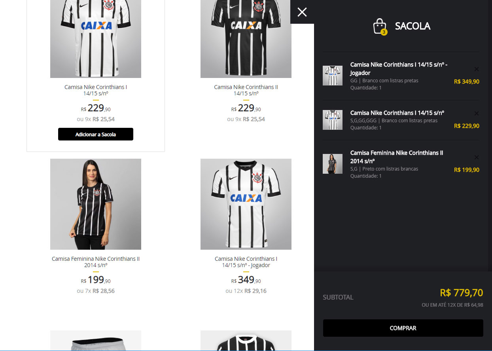

# Netshoes Test

This project was generated with [Angular CLI](https://github.com/angular/angular-cli) version 7.3.8.

## Stack used

| SERVER | CLIENT |
| --- | ---  |
| NodeJS | Angular |
| Express| Bootstrap |
| Morgan| | 

## How to run app

Run `npm start` to start server and client in parallel.

Server: http://localhost:1977/api/v1/products

Client: http://localhost:2012

## Running unit tests

Run `ng test` to execute the unit tests via [Karma](https://karma-runner.github.io).
